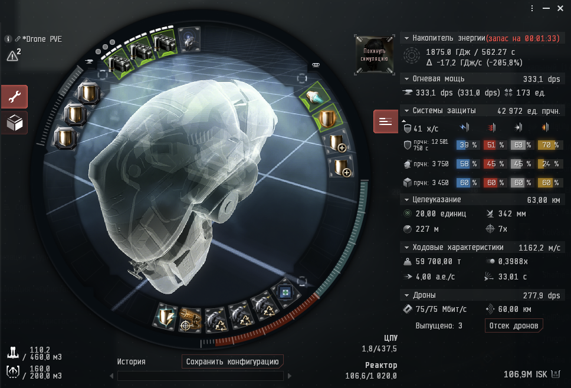

# settings

## View Panel

Panel `*`:

Similar to `General: All`.

Panel `WarpTo`:

Warp gates, beacons, stations and etc.

Panel `Target`:

PvE, PvP targets, your fleet and etc.

Panel `Cargo`:

Crates and etc.

Panel `Mining`:

Similar to `Drilling: Drilling`.

Panel `Crew`:

Contains your fleet.

## Fits

### Vexor Navi Issue

#### Drone PVE

Build to farm Guristas 4/10 DED.

Firstly use Vespas and Hornet to kill frigates and after use 1 * Hornet, 2 * Vespa, 2 * Wasp for cruiser and other
targets.

